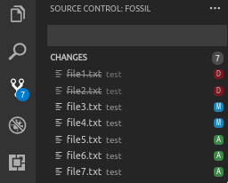

# fossil-scm README

This is a plugin for [Fossil SCM](https://www.fossil-scm.org).  It is still under development.  It has not yet been released to the VSCode Marketplace.

The icons being used for the file statuses are from the [Microsoft VSCode Git Extension](https://github.com/Microsoft/vscode/tree/master/extensions/git).

## Features

Currently, it only supports a basic file listing, which is based on the command `fossil status`.

## Requirements

- You will need to install [Fossil SCM](https://www.fossil-scm.org).
- [Visual Studio Code](https://code.visualstudio.com/) 1.27.0+ must be installed.

## Installation
This extension has not yet been released, but can be tested using the [Extension Development Host](https://code.visualstudio.com/docs/extensions/testing-extensions).
You can also copy the entire source folder to your extensions folder for testing (e.g. C:\Users\myUserName\\.vscode\extensions)

## Configuration
You must configure the location to **fossil.exe** using the setting **fossilScm.fossilExePath** in *settings.json*.

## Known Issues

- Selecting a file in the SCM file list currently does not bring up a diff viewer.
- The SCM text box is currently not functional.
- Files which are currently not in the Fossil repository are not visible in the SCM file list.  You will need to add them manually in order for them to show up.
- Merging is not yet available.
- All other Fossil functionality besides `fossil status` is currently not available.
- The extension does not currently launch automatically.  You must launch it manually using ctrl-shift-P, and type "Fossil SCM".

## Contributing

Contributions are welcome.

## License

See [LICENSE](LICENSE).