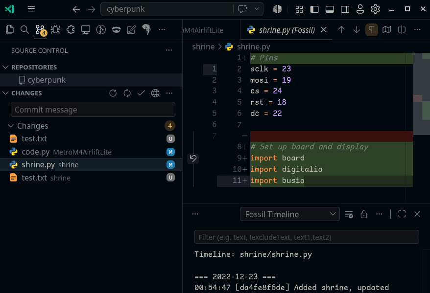
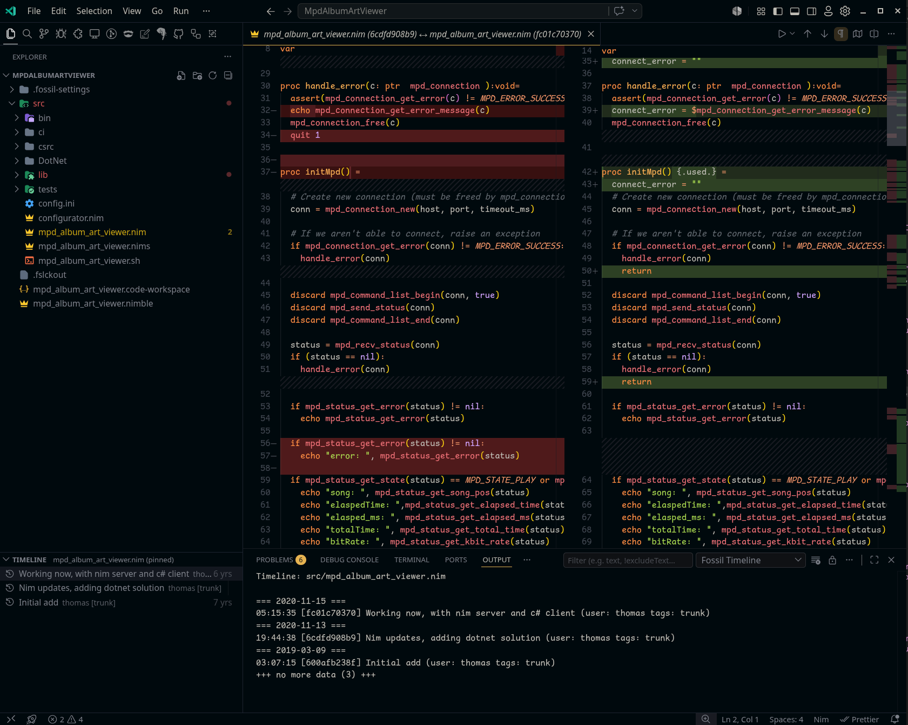
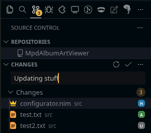
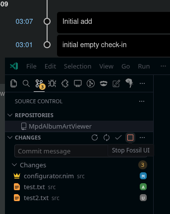
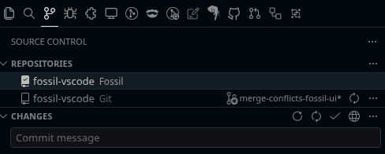

[](https://github.com/darkmusic/fossil-vscode/actions/workflows/ci.yml)

# Fossil SCM for VS Code

A [Visual Studio Code](https://code.visualstudio.com/) extension for [Fossil SCM](https://www.fossil-scm.org) checkouts. It is still under development and has not yet been released to the VS Code Marketplace.

Status icons are from the [Microsoft VS Code Git extension](https://github.com/microsoft/vscode/tree/main/extensions/git).

## Screenshots

### Source Control with diff viewer (integrated)



### Timeline with diff viewer (split)



### Source Control commit flow / untracked file visibility



### Fossil UI integration



### Multiple SCM per repo support



## Features

When you open a Fossil checkout (a workspace folder containing `.fslckout` or `_FOSSIL_`), the extension activates automatically and shows pending changes in the **Source Control** view under **Fossil → Changes** and **Fossil → Merge Conflicts**, based on `fossil status --differ` (tracked changes plus untracked files not covered by ignore rules).

Supported change types:

| Fossil status | Shown as        |
|---------------|-----------------|
| EDITED        | Modified        |
| DELETED       | Deleted         |
| ADDED         | Added           |
| UNMANAGE      | Unmanaged       |
| EXTRA         | Unmanaged       |
| RENAMED       | Renamed         |
| CONFLICT      | Conflict        |

The list refreshes when files in the workspace change (debounced to avoid excessive `fossil status` calls). In a multi-root workspace, the extension uses the folder that contains the Fossil checkout markers.

**SCM actions:**

- **Refresh** — toolbar refresh button or **Fossil: Refresh** / **Fossil SCM** (Command Palette) refreshes the Changes list immediately.
- **Sync** — toolbar sync button or **Fossil: Sync** runs `fossil sync` with the default remote (the URL from the most recent clone, pull, push, remote, or sync). Refreshes the Changes list when sync finishes. If merge conflicts remain, a warning is shown instead of the success message.
- **Start Fossil UI** / **Stop Fossil UI** — SCM toolbar buttons to run `fossil ui` in a background process (opens the local web UI in your browser) and stop the process started by the extension.
- **Commit** — enter a message in the SCM input box, then click the checkmark or press Ctrl+Enter (Cmd+Enter on macOS) to run `fossil commit -m`.
- **Add to checkout** (+) — right-click an unmanaged file to run `fossil add`.
- **Reset add** (−) — right-click an added file to run `fossil add --reset`.
- **Revert** — right-click a changed tracked file to run `fossil revert` (not shown for unmanaged `EXTRA` / `UNMANAGE` files).

**Opening changes:** Click a file under **Fossil → Changes** to open a diff against the checkout baseline (via `fossil cat`). Modified files compare repository vs working tree; added files compare an empty baseline vs the new file; deleted files open the repository version; renames compare the old path (baseline) vs the new path; unmanaged files open the working file only.

**Merge conflicts:** Files with unresolved Fossil merge markers appear under **Fossil → Merge Conflicts** with a conflict icon. Click a conflicted file to open the working copy in the editor so VS Code’s inline merge conflict actions (Accept Current / Incoming / Both) can be used. For the 3-way merge editor when Fossil has left `*-baseline`, `*-original`, and `*-merge` sidecar files (for example after `fossil merge -K`), right-click the file under **Merge Conflicts** or run **Fossil: Open in Merge Editor** from the Command Palette with that file open in the editor. Remove all conflict markers before committing.

**Editor gutter diff:** While editing a changed tracked file, VS Code shows inline **Fossil** quick diff markers comparing your edits to the checkout baseline.

**File history:**

- **View Timeline (output):** Right-click a file under **Fossil → Changes**, or run **Fossil: View Timeline (Output)** from the Command Palette with a file open in the editor. Output appears in the **Fossil Timeline** panel (`fossil timeline -p` for that path).
- **View Timeline (explorer):** Right-click a file in the Explorer and choose **Fossil: View Timeline** to refresh the **Fossil Timeline** output and open the **Timeline** view. VS Code’s built-in **Open Timeline** only opens the Timeline view (no Fossil output channel).
- **Timeline view:** With a workspace file open, open the Explorer **Timeline** panel and select the **Fossil** source to see check-ins that changed that file. Click an entry to open a diff of the changes introduced in that check-in: parent revision vs that check-in (or an empty file vs the new version when the file was added in that check-in). Right-click an entry for **Open Diff** or **Copy Check-in ID**.

## Requirements

- [Fossil SCM](https://www.fossil-scm.org) installed and available on your `PATH` (or configured explicitly; see below)
- [Visual Studio Code](https://code.visualstudio.com/) 1.95.0 or newer

## Usage

1. Open the **checkout directory** as your VS Code workspace (the folder that contains `.fslckout` or `_FOSSIL_`), not only a parent directory.
2. Open the **Source Control** view. Changed and untracked files appear under **Fossil → Changes**; merge conflicts appear under **Fossil → Merge Conflicts** when `fossil status --differ` reports them.

## Installation

The extension is not on the Marketplace yet. To try it locally:

### From source

```bash
git clone https://github.com/darkmusic/fossil-vscode.git
cd fossil-vscode
npm install
npm run compile
```

Then either:

- **Extension Development Host** — press F5 in VS Code ([testing extensions](https://code.visualstudio.com/docs/extensions/testing-extensions)), or
- **Copy into extensions folder** — copy or symlink the project into your extensions directory (for example `~/.vscode/extensions` on Linux), then run **Developer: Reload Window**.

### VSIX package

```bash
npm install
npm run vsix      # type-check, production bundle, and package to .vsix
code --install-extension fossil-scm-*.vsix
```

After installing or updating, reload the window so activation and settings apply.

## Configuration

| Setting | Default | Description |
|---------|---------|-------------|
| `fossilScm.fossilExePath` | `fossil` | Path to the Fossil executable. Set this if `fossil` is not on the `PATH` used by VS Code (for example `C:\\Tools\\fossil.exe` on Windows). |
| `fossilScm.openDiffOnClick` | `true` | When `true`, clicking a file in **Changes** opens the diff editor. When `false`, opens the working tree file (deleted files open the repository version). |

Example in `settings.json`:

```json
{
  "fossilScm.fossilExePath": "fossil"
}
```

## Known issues

See [GitHub Issues](https://github.com/darkmusic/fossil-vscode/issues).

## Contributing

Contributions are welcome.

### Development

```bash
npm install
npm run compile      # Tests → out/, extension → dist/
npm run watch        # Parallel type-check watch and esbuild watch
npm run package      # Production bundle (dist/) for packaging
npm test             # Integration tests (see below)
```

### Running tests

Integration tests require Fossil on your `PATH` and an opened copy of the test repository:

```bash
cd src/test/test_repo && fossil open TestRepo.fossil
npm test
```

### CI and releases

GitHub Actions run on every push and pull request to `main` (type-check, compile, Fossil integration tests). To build a VSIX without tagging, run the **VSIX Package** workflow from the Actions tab.

To publish a GitHub Release with a VSIX attached:

1. Bump `version` in `package.json` and update `CHANGELOG.md`.
 2. Commit on `main`, then tag and push: `git tag v0.0.2 && git push origin v0.0.2` (tag must be `v<package.json version>`, e.g. `v0.0.2`).
 3. The **Create Release** workflow uploads the VSIX to the new release.

## License

See [LICENSE](LICENSE).
