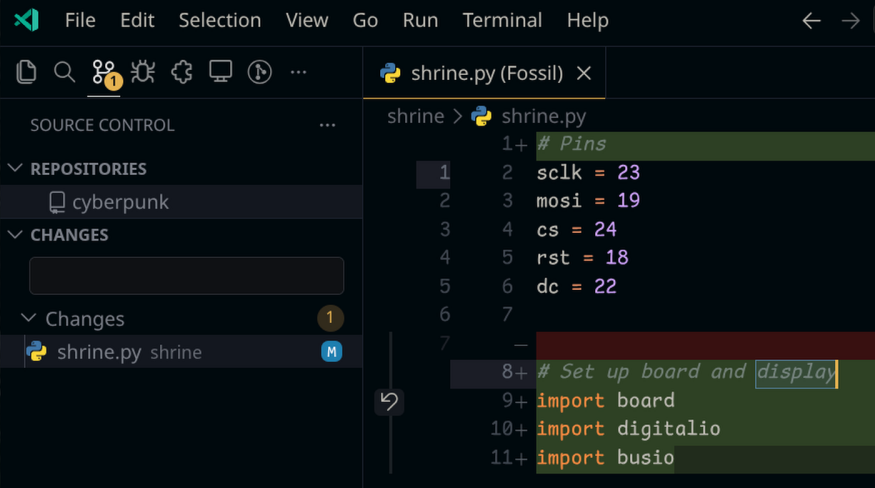

# Fossil SCM for VS Code

A [Visual Studio Code](https://code.visualstudio.com/) extension for [Fossil SCM](https://www.fossil-scm.org) checkouts. It is still under development and has not yet been released to the VS Code Marketplace.

Status icons are from the [Microsoft VS Code Git extension](https://github.com/microsoft/vscode/tree/main/extensions/git).

## Features

When you open a Fossil checkout (a workspace folder containing `.fslckout` or `_FOSSIL_`), the extension activates automatically and shows pending changes in the **Source Control** view under **Fossil → Changes**, based on `fossil status`.

Supported change types:

| Fossil status | Shown as        |
|---------------|-----------------|
| EDITED        | Modified        |
| DELETED       | Deleted         |
| ADDED         | Added           |
| UNMANAGE      | Unmanaged       |
| EXTRA         | Unmanaged       |
| RENAMED       | Renamed         |
| CONFLICT      | Conflict        |

The list refreshes when files in the workspace change. In a multi-root workspace, the extension uses the folder that contains the Fossil checkout markers.

**Opening changes:** Click a file under **Fossil → Changes** to open a diff against the checkout baseline (via `fossil cat`). Modified and conflict files compare repository vs working tree; added files compare an empty baseline vs the new file; deleted files open the repository version; renames compare the old path (baseline) vs the new path; unmanaged files open the working file only.

**Editor gutter diff:** While editing a changed tracked file, VS Code shows inline **Fossil** quick diff markers comparing your edits to the checkout baseline.

You can also run the command **Fossil SCM** from the Command Palette to refresh the status manually.



## Requirements

- [Fossil SCM](https://www.fossil-scm.org) installed and available on your `PATH` (or configured explicitly; see below)
- [Visual Studio Code](https://code.visualstudio.com/) 1.95.0 or newer

## Usage

1. Open the **checkout directory** as your VS Code workspace (the folder that contains `.fslckout` or `_FOSSIL_`), not only a parent directory.
2. Open the **Source Control** view. Changed files appear under **Fossil → Changes** when `fossil status` reports them.

## Installation

The extension is not on the Marketplace yet. To try it locally:

### From source

```bash
git clone https://github.com/darkmusic/fossil-vscode.git
cd fossil-vscode
npm install
npm run compile
```

Then either:

- **Extension Development Host** — press F5 in VS Code ([testing extensions](https://code.visualstudio.com/docs/extensions/testing-extensions)), or
- **Copy into extensions folder** — copy or symlink the project into your extensions directory (for example `~/.vscode/extensions` on Linux), then run **Developer: Reload Window**.

### VSIX package

```bash
npm install
npm run package   # type-check and production bundle via esbuild
npx @vscode/vsce package
code --install-extension fossil-scm-*.vsix
```

After installing or updating, reload the window so activation and settings apply.

## Configuration

| Setting | Default | Description |
|---------|---------|-------------|
| `fossilScm.fossilExePath` | `fossil` | Path to the Fossil executable. Set this if `fossil` is not on the `PATH` used by VS Code (for example `C:\\Tools\\fossil.exe` on Windows). |
| `fossilScm.openDiffOnClick` | `true` | When `true`, clicking a file in **Changes** opens the diff editor. When `false`, opens the working tree file (deleted files open the repository version). |

Example in `settings.json`:

```json
{
  "fossilScm.fossilExePath": "fossil"
}
```

## Known issues

See [GitHub Issues](https://github.com/darkmusic/fossil-vscode/issues).

## Contributing

Contributions are welcome.

### Development

```bash
npm install
npm run compile      # TypeScript → out/
npm run watch        # Parallel type-check watch and esbuild watch
npm run package      # Production bundle (dist/) for packaging
npm test             # Integration tests (see below)
```

### Running tests

Integration tests require Fossil on your `PATH` and an opened copy of the test repository:

```bash
cd src/test/test_repo && fossil open TestRepo.fossil
npm test
```

## License

See [LICENSE](LICENSE).
